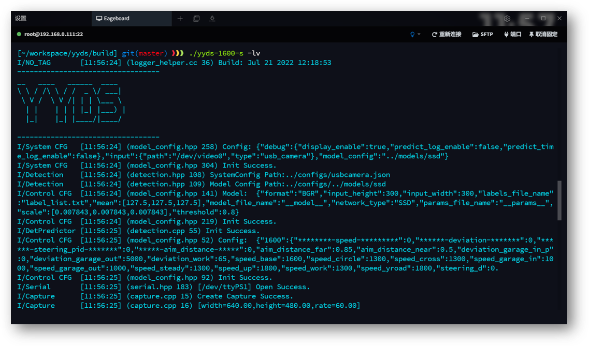
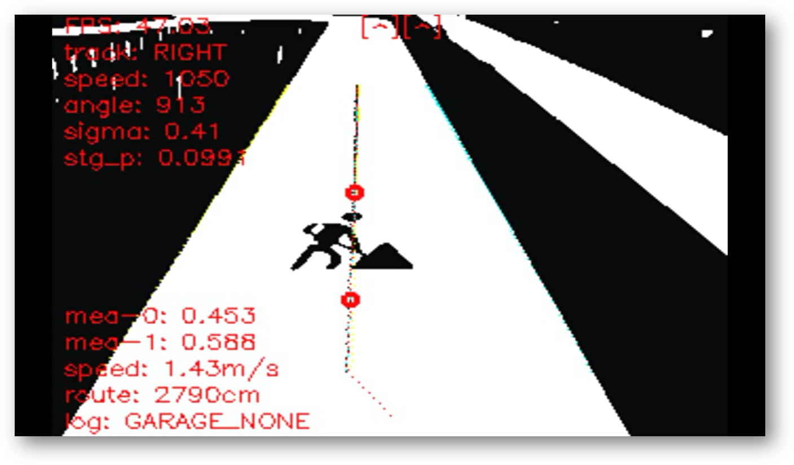
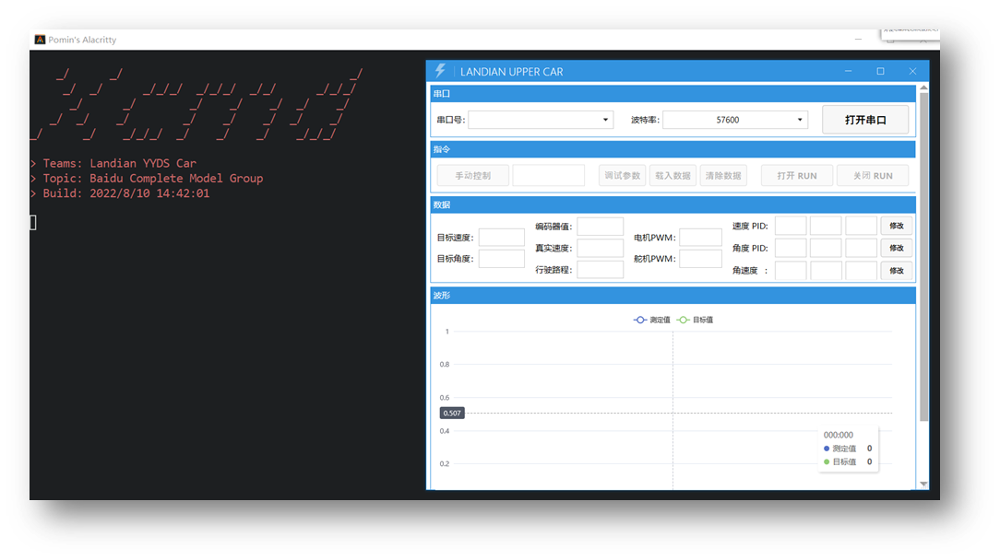

# 蓝电 YYDS Car

湖北工业大学 - 蓝电 YYDS Car  
第十七届全国大学生智能汽车竞赛 - 完全模型组

校赛(第一名) -> 华南赛区(第四名) -> 国赛(线下第五名 - 全国一等奖)

---

---

## Edgeboard 程序

> 在此感谢以下开源算法:   
> 上海交通大学: <https://github.com/SJTU-AuTop/RT1064-Code>  
> 完全模型组官方: <https://github.com/Leo-smart/Intelligentcar2022-FZ3B>  

- [x] 基础元素识别、打印

  - [x] 去畸变和透视变换
  - [x] 基于角点识别赛道元素
  - [x] 单线偏移的目标轨迹规划

- [x] 标志识别、打印
- [x] JSON 配置项读取
- [x] 图像、边线、锚点显示
- [x] 日志输出命令行、文件

## TC212 控制端调参上位机

为了能够观察各个变量的给定和输出波形，以更方便的进行调试分析，我队使用C#开发了一款上位机。

- [x] 波形显示
- [x] 命令行内交互
- [x] 遥控车辆运动
- [x] PID参数调试、读写

